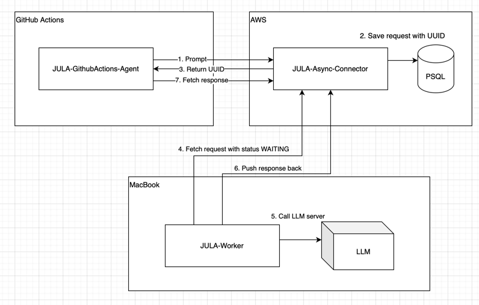

# JULA-GitHubActions-Agent
***JU**nit **L**LM **A**utomator*

This repository is a part of PoC project aimed to automate JUnit-Based test generation using locally ran Large Language
Model server (Ollama).  
Other components:

- [JULA-Worker](https://github.com/MarshallBaby/JULA-Worker)
- [JULA-Async-Connector](https://github.com/MarshallBaby/JULA-Async-Connector)

## GitHub Actions Agent

This service runs within a GitHub Actions job and communicates with the JULA Async Connector to retrieve generated test classes.

Workflow:
1. Mark the required Java classes with the @JULA:on annotation as a comment.
2. Perform a git push.
3. The collect-required-files.py script collects all required files.
4. If no files for execution are found, the job will be terminated.
5. If one or more files are found, the JULA GitHub Actions Agent starts.
6. The JULA GitHub Actions Agent calls the JULA Async Connector to generate tests.
7. enerated test classes are written to the repository.
8. @JULA:on annotations are removed from the source classes.
9. All changes are committed.

GitHub Actions Workflow example:
[workflow-example.yml](readme/example/workflow-example.yml)